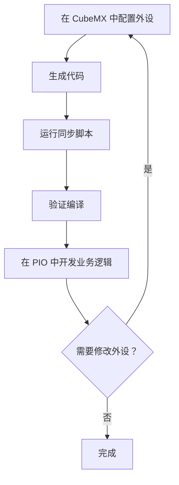

# CubeMX 与 PlatformIO 集成 - 完整实践指南

## 📌 快速答案

### Q1: 在 CubeMX 中应该选择哪种工具链？

**答：选择 `Makefile`**

原因：
- 最接近 PlatformIO 的构建方式
- 不生成 IDE 特定文件
- 代码结构清晰

### Q2: 需要复制哪些文件？

**答：只需复制 `Core/` 目录下的必要文件**

```
需要复制：                    不需要复制：
├── Core/Inc/             ✗   Drivers/          (PIO 自动管理)
│   ├── *.h               ✗   Makefile          (PIO 有自己的构建系统)
│   └── main.h            ✗   .mxproject        (CubeMX 配置文件)
├── Core/Src/             ✗   startup_*.s       (PIO 自动处理)
│   ├── stm32f1xx_*.c     ✗   *.ld              (PIO 有自己的链接脚本)
│   └── main.c            ✗   syscalls.c        (PIO 已提供)
│                           ✗   sysmem.c          (PIO 已提供)
```

### Q3: 文件应该放到哪里？

**答：保持现有 PIO 结构，不要新建文件夹**

```
PIO_TEST2/
├── include/          ← 复制 Core/Inc/*.h 到这里
└── src/              ← 复制 Core/Src/*.c 到这里
```

---

## 🚀 自动化脚本使用

### 方式 1：双击运行（最简单）

```bash
# 在 PIO_TEST2 目录下
双击 sync.bat
```

### 方式 2：PowerShell 运行

```bash
.\sync_cubemx_simple.ps1
```

### 方式 3：使用 VSCode 任务

按 `Ctrl+Shift+P` → 输入 "Tasks: Run Task" → 选择 "🔄 Sync CubeMX (标准模式)"

---

## 📋 完整同步流程

### 步骤 1：在 CubeMX 中配置

1. 打开 STM32CubeMX
2. 配置你的外设（GPIO、UART 等）
3. 在 **Project Manager** 中选择：
   - Toolchain / IDE: **Makefile**
   - 生成路径：任意临时目录
4. 点击 **Generate Code**

### 步骤 2：运行同步脚本

```bash
# 在 PIO_TEST2 目录
.\sync.bat

# 选择选项 1: 标准模式
```

脚本会自动：
- ✅ 备份现有文件
- ✅ 复制头文件到 `include/`
- ✅ 复制源文件到 `src/`
- ✅ 处理 main.c（需要手动合并）

### 步骤 3：验证编译

```bash
pio run
```

### 步骤 4：手动合并 main.c

**重要！** 脚本会备份你的 main.c，但需要手动合并业务逻辑：

1. 打开备份文件：`src/backup/main.c.TIMESTAMP.bak`
2. 打开新生成的：`src/main.c`
3. 复制你的业务逻辑到新文件的 `USER CODE BEGIN/END` 块中

---

## 🎯 最佳实践方案

### 推荐方案：**初始导入 + 手动维护**

#### 工作流程



#### 具体操作

**1. 首次配置（一次性）**

```bash
# CubeMX 配置所有外设
# 生成代码
# 运行同步脚本
.\sync.bat

# 验证编译
pio run
```

**2. 在 PlatformIO 中开发**

```c
// src/main.c

/* USER CODE BEGIN Includes */
#include <stdio.h>
#include <string.h>
/* USER CODE END Includes */

/* USER CODE BEGIN PV */
char buffer[100];
/* USER CODE END PV */

/* USER CODE BEGIN 0 */
void LED_Blink(void) {
    HAL_GPIO_TogglePin(GPIOC, GPIO_PIN_13);
}
/* USER CODE END 0 */

int main(void) {
    // ... CubeMX 生成的初始化代码 ...
    
    while (1) {
        /* USER CODE BEGIN WHILE */
        LED_Blink();
        HAL_Delay(500);
        
        sprintf(buffer, "Hello World\n");
        HAL_UART_Transmit(&huart1, (uint8_t*)buffer, strlen(buffer), 100);
        /* USER CODE END WHILE */
    }
}
```

**3. 如需修改外设**

```bash
# 在 CubeMX 中修改配置
# 重新生成代码
# 运行同步脚本
.\sync.bat

# 手动合并 main.c 中的业务逻辑
# 验证编译
pio run
```

#### 优点

- ✅ **代码稳定** - 不频繁同步，减少冲突风险
- ✅ **版本可控** - Git 提交清晰
- ✅ **开发高效** - 专注业务逻辑
- ✅ **易于调试** - 问题容易定位

#### 缺点

- ⚠️ 需要手动合并 main.c（但很简单）
- ⚠️ 外设变更需要重新同步

---

## 🔍 方案对比分析

### 方案 A：初始一次性导入后不再自动覆盖（推荐 ⭐⭐⭐⭐⭐）

**适用场景：**
- 项目已稳定
- 外设配置不常变更
- 有代码管理经验

**操作流程：**
```bash
# 仅首次同步
.\sync.bat

# 后续手动维护 main.c
# 使用 Git 管理版本
```

**风险评估：**
- 风险等级：**低**
- 主要风险：外设变更时需要手动合并
- 缓解措施：完整备份 + Git 版本控制

### 方案 B：每次同步前回滚到 CubeMX（不推荐 ⭐⭐）

**适用场景：**
- 原型开发阶段
- 频繁修改外设配置
- 有充足测试时间

**操作流程：**
```bash
# 每次修改前
.\sync_cubemx.ps1 -SyncBack  # 同步回 CubeMX

# 在 CubeMX 中修改
# 重新生成
# 同步到 PIO
.\sync.bat
```

**风险评估：**
- 风险等级：**高**
- 主要风险：
  - ❌ 可能丢失 PIO 特定优化
  - ❌ 双向同步冲突
  - ❌ 调试困难
- 缓解措施：完整备份 + 详细测试

### 方案 C：选择性同步（折中方案 ⭐⭐⭐⭐）

**适用场景：**
- 外设配置较频繁
- 需要保持与 CubeMX 同步
- 有自动化测试

**操作流程：**
```bash
# 仅复制硬件抽象层
.\sync.bat

# 手动检查变更
# 选择性应用业务逻辑
```

**风险评估：**
- 风险等级：**中**
- 主要风险：手动操作可能出错
- 缓解措施：检查清单 + 代码审查

---

## 📊 决策矩阵

| 项目阶段 | 推荐方案 | 同步频率 | 风险等级 |
|---------|---------|---------|---------|
| 原型开发 | 方案 C | 高 | 低 |
| 功能开发 | 方案 A | 低 | 低 |
| 系统测试 | 方案 A | 极低 | 极低 |
| 维护阶段 | 方案 A | 无 | 无 |
| 紧急修复 | 手动修改 | 无 | 中 |

---

## ⚠️ 注意事项

### 1. main.c 合并要点

**必须保留的内容：**
```c
/* USER CODE BEGIN xxx */
// 你的所有代码都在这些块中
/* USER CODE END xxx */
```

**会被覆盖的内容：**
```c
// CubeMX 生成的初始化函数
void SystemClock_Config(void);
void MX_USART1_UART_Init(void);
void MX_GPIO_Init(void);
```

### 2. 其他文件处理

**可以直接覆盖的文件：**
- `stm32f1xx_hal_msp.c` - 通常不需要修改
- `stm32f1xx_it.c` - 中断服务程序（如有自定义，放在 USER CODE 块）
- `system_stm32f1xx.c` - 系统初始化

**需要检查的文件：**
- `main.h` - 检查是否有用户定义

### 3. 备份管理

**备份位置：**
```
src/backup/
├── main.c.20260317_135254.bak
├── stm32f1xx_it.c.20260317_135254.bak
└── ...
```

**恢复备份：**
```bash
# PowerShell
Copy-Item src\backup\main.c.*.bak src\main.c -Force
```

**清理旧备份：**
```bash
.\sync_cubemx_simple.ps1  # 手动删除 backup 目录
```

---

## 🛠️ 高级技巧

### 技巧 1：使用 Git 管理版本

```bash
# 初始化 Git
git init

# 添加 .gitignore
echo "src/backup/" >> .gitignore
echo "include/backup/" >> .gitignore

# 每次同步前提交
git add .
git commit -m "Before CubeMX sync"

# 同步后如有问题可回滚
git reset --hard HEAD~1
```

### 技巧 2：使用 Beyond Compare 合并

```bash
# 安装 Beyond Compare
# 同步后比较差异
"Beyond Compare 4\BC.exe" src\backup\main.c.*.bak src\main.c
```

### 技巧 3：自动化测试

```bash
# 创建测试脚本 test_sync.bat
@echo off
pio run
if %ERRORLEVEL% NEQ 0 (
    echo Build failed! Rolling back...
    git reset --hard HEAD~1
    exit /b 1
)
echo Build successful!
```

### 技巧 4：使用 VSCode 插件

推荐插件：
- **GitLens** - Git 版本控制
- **Partial Diff** - 比较代码片段
- **Git Graph** - 可视化 Git 历史

---

## ❓ 常见问题

### Q1: 同步后编译失败

**可能原因：**
```
Error: stm32f1xx_hal.h: No such file or directory
```

**解决方案：**
```ini
; platformio.ini
[env:genericSTM32F103C8]
platform = ststm32
board = genericSTM32F103C8
framework = stm32cube

build_flags = 
    -Iinclude
    -DUSE_HAL_DRIVER
    -DSTM32F103xB
```

### Q2: 代码丢失怎么办？

**紧急恢复：**
```bash
# 从备份恢复
Copy-Item src\backup\main.c.*.bak src\main.c -Force

# 或使用 Git
git checkout HEAD -- src/main.c
```

### Q3: 如何合并多次 CubeMX 配置？

**场景：** 配置了 UART 后，又要配置 SPI

**错误做法：**
```bash
# 配置 UART → 同步
# 配置 SPI → 同步（会覆盖 UART 配置）
```

**正确做法：**
```bash
# 在 CubeMX 中同时配置 UART 和 SPI
# 一次性生成
# 运行同步脚本
.\sync.bat
```

### Q4: 可以自动合并 main.c 吗？

**答：** 可以，但有风险

脚本提供了简单的合并功能，但建议：
- ✅ 首次同步使用自动合并
- ⚠️ 后续同步手动检查
- ❌ 复杂业务逻辑不要依赖自动合并

### Q5: 是否需要同步 Drivers？

**答：不需要！**

PlatformIO 通过 `framework-stm32cube` 包自动提供 HAL 库。

```ini
; platformio.ini 会自动处理
platform = ststm32
framework = stm32cube
```

---

## 📦 脚本功能说明

### sync.bat
- 快速启动批处理
- 调用 PowerShell 脚本
- 适合双击运行

### sync_cubemx_simple.ps1
- 简化版 PowerShell 脚本
- 基本文件同步功能
- 备份机制
- 交互式菜单

### sync_cubemx.py (完整版)
- Python 跨平台版本
- 智能 main.c 合并
- 双向同步支持
- 备份管理

---

## 🎓 总结

### 最佳实践要点

1. **首次配置**
   - 在 CubeMX 中完成所有外设配置
   - 运行同步脚本
   - 验证编译成功

2. **日常开发**
   - 在 PlatformIO 中编写业务逻辑
   - 使用 `USER CODE BEGIN/END` 块
   - Git 版本控制

3. **配置变更**
   - 在 CubeMX 中修改
   - 重新生成
   - 运行同步脚本
   - 手动合并 main.c
   - 验证编译

4. **备份策略**
   - 同步前自动备份
   - 定期清理旧备份
   - 重要节点 Git 提交

### 风险规避

- ✅ 始终使用备份
- ✅ 使用 Git 版本控制
- ✅ 编译验证
- ✅ 手动检查 main.c
- ❌ 避免频繁双向同步
- ❌ 不要在自动生成的代码中写业务逻辑

### 工具选择

| 工具 | 用途 | 推荐度 |
|------|------|--------|
| sync.bat | 快速同步 | ⭐⭐⭐⭐⭐ |
| Git | 版本控制 | ⭐⭐⭐⭐⭐ |
| Beyond Compare | 代码合并 | ⭐⭐⭐⭐ |
| VSCode Tasks | 集成开发 | ⭐⭐⭐⭐ |

---

## 📞 技术支持

如遇到问题：
1. 检查备份文件
2. 查看编译错误
3. 使用 Git 回滚
4. 参考本指南

**祝开发顺利！** 🎉
